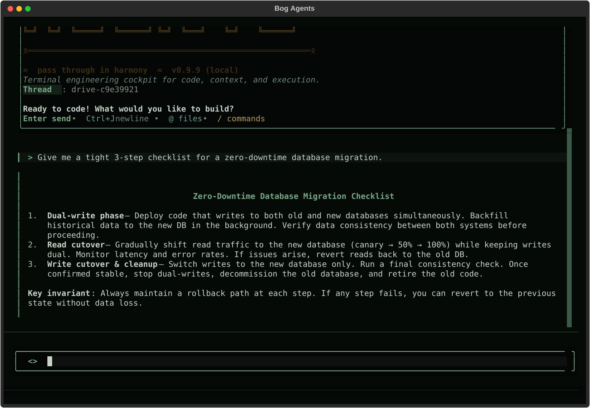

<p align="center">
  <strong>A production-ready AI agent framework built on LangGraph.</strong><br>
  Run it in your terminal, embed it in your app, or leave it working on a server —
  one install, a compiled agent, nothing to wire up.
</p>

<p align="center">
  <a href="https://pypi.org/project/bog-agents-cli/"></a>
  <a href="https://pypi.org/project/bog-agents-cli/"></a>
  <a href="https://github.com/bogware/bog-agents/actions/workflows/ci.yml"></a>
  <a href="LICENSE"></a>
</p>

<p align="center">
  
</p>

Most frameworks hand you the parts and wish you luck. Bog Agents hands you a
working agent — file tools, a real shell, git, sub-agents, plan mode, and ~90
composable middlewares out of the box — then lets you peel layers away or bolt
new ones on as the job demands. Secure-by-default backends, bounded retries,
and governed autonomy are the baseline, not an afterthought.

Three packages, one stack:

- **[`bog-agents`](libs/bog-agents)** — the Python SDK. `create_agent()` returns a
  compiled LangGraph agent with file tools, a shell, git, sub-agents, plan mode,
  retry-with-backoff, and ~90 composable middlewares. Governed autonomy is
  first-class: **agent teams** (`bog_agents.teams`), **runaway cost caps**
  (`bog_agents.cost_ledger`), **proof-of-work evidence bundles**
  (`bog_agents.evidence`), evals + guardrails as importable primitives, and an
  **OS-level sandbox** (bubblewrap/seatbelt + an egress-allowlist proxy) for
  `LocalShellBackend`. Drop-in
  [deepagents](https://github.com/langchain-ai/deepagents) compatibility, too —
  `create_deep_agent`, `DeepAgentState`, filesystem permissions, harness/provider
  profiles.
- **[`bog-agents-cli`](libs/cli)** — a coding agent that lives in your terminal.
  125+ slash commands, any LLM, persistent memory, MCP marketplace. Turn the
  engine up when it matters: **`/team run`** (a governed team over a task ledger),
  **`/best-of-n`** (N worktree attempts, rubric-judged winner), **`/jury`**
  (multi-reviewer vote on a diff), **`/operator`** (auto difficulty routing), and
  **`/effort`** (real per-provider reasoning knobs). Plus `/peat` personal
  scheduler, `/qa` acceptance-criteria harness, `/record` + `/replay`, an
  in-memory secrets vault, `bog-agents --drive <script.yaml>` for scripted runs, and a full
  **headless surface** so an AI agent or CI job can drive it without a human
  at the keyboard. Matte-swamp TUI.
- **[`bog-agents-daemon`](libs/daemon)** — the patient watcher. Runs your
  agents on cron / file-change / webhook / git-push triggers; survives
  reboots; reports back via Slack / email / GitHub / file / webhook.

Built on [LangGraph](https://github.com/langchain-ai/langgraph). MIT-licensed.

---

## Why Bog Agents

- **Resilient by default.** Failures retry with bounded backoff, hung commands
  time out, and a provider hiccup never kills the run. A crash drops a redacted
  panic dump so the bug report writes itself.
- **Secure where it counts.** Secure-by-default backends, an optional OS-level
  sandbox with a network egress allowlist, a memory-only secrets vault that
  never touches disk, and tokens written atomically at `0o600` before the
  rename — no world-readable race window.
- **Governed autonomy.** Agent teams, best-of-N with a rubric judge, and
  multi-reviewer diff votes — all bounded by hard cost caps and packaged with
  proof-of-work evidence, so you can trust a run you didn't watch.
- **No ceremony.** `pipx install bog-agents-cli && bog-agents` puts a working
  agent in front of you in under a minute; `pip install bog-agents` plus one
  function call embeds one in your code.
- **Composable to the core.** ~90 middlewares snap on or off, sub-agents nest,
  backends swap. The framework gets out of the way as your needs sharpen.

---

## Quick install

### CLI (most folks start here)

```bash
# pipx is recommended — isolated install, clean PATH
pipx install bog-agents-cli

# or with uv (fastest)
uv tool install bog-agents-cli

# or plain pip
pip install bog-agents-cli
```

Provider extras:

```bash
pip install 'bog-agents-cli[anthropic]'        # Claude
pip install 'bog-agents-cli[openai]'           # GPT
pip install 'bog-agents-cli[bedrock]'          # AWS Bedrock
pip install 'bog-agents-cli[all-providers]'    # everything
```

Set one provider key and ride:

```bash
export ANTHROPIC_API_KEY=sk-ant-...     # or OPENAI_API_KEY, GOOGLE_API_KEY, AWS creds, ...
bog-agents --doctor-deep                # one-page health check
bog-agents                              # interactive TUI
bog-agents -p "explain this module" < src/agent.py   # one-shot
```

No key handy? Point it at a local [Ollama](https://ollama.com/) model and
nothing leaves the machine.

Keep current with `/update` inside the TUI — it checks PyPI, shows what will
download, asks before installing, and upgrades the way you installed (uv tool /
pipx / pip).

### Daemon (ambient runner)

```bash
pip install bog-agents-daemon
bog-agents-daemon run --port 7878
```

See the [daemon README](libs/daemon/README.md) for systemd / Windows-task /
launchd installation, the REST API, trigger types, and output targets.

### SDK only (for embedding agents in your own app)

```bash
pip install bog-agents
```

```python
from bog_agents import create_agent

agent = create_agent(model="anthropic:claude-sonnet-4-6")
result = await agent.ainvoke({"messages": [{"role": "user", "content": "hi"}]})
```

See the [SDK README](libs/bog-agents/README.md) for backends, middlewares,
deepagents compatibility, and the full provider matrix.

---

## What's new in 0.9.x

The 0.9 line is the run from a credible flagship toward 1.0. Each release
hardened a different stretch of trail.

- **0.10 — Claude-Code-style auto mode, MCP server, self-verification, and
  two new SDK primitives.** The marquee batch:
  - **Permission modes (auto mode).** Shift+Tab cycles `default → accept-edits
    → plan`; Ctrl+T toggles bypass; a live status indicator; a
    `--permission-mode {default,acceptEdits,plan,bypass,paranoid}` flag (plus
    `--dangerously-skip-permissions`).
  - **`bog-agents mcp-server`.** Expose the agent *as* an MCP server, so Claude
    Desktop, Cursor, Zed, or Copilot can delegate a whole coding task to it.
  - **`/self-review`.** Fan five reviewer lenses (correctness, security,
    maintainability, tests, over-claims) over your own diff → `SHIP` /
    `FIX-FIRST` verdict; `--fix` loops until clean.
  - **`/ci-fix`.** Read the branch's CI via `gh`, ingest the failing-job logs,
    and diagnose + fix.
  - **`@codebase`** semantic search, **repo-committed `.prompt.md`** files that
    auto-register as slash commands, **agent-written auto-memories** (a
    `remember` tool that persists conventions/gotchas to the AGENTS.md cascade),
    and **shell pass-through** (`!command` output now enters the agent's
    context so it can see what you ran).
  - **Governed autonomy — turn the engine up.** **`/team run`** runs a real
    agent team over a claimable, dependency-aware task ledger; **`/best-of-n`**
    runs N attempts in isolated git worktrees and keeps the rubric-judged winner;
    **`/jury`** gets a multi-reviewer vote on a diff; **`/operator`** lets a cheap
    judge auto-escalate model + effort (and route hard jobs to `butcher` /
    `jtbd`). All bounded by **runaway cost caps** so nothing fork-bombs the bill.
  - **OS-level sandbox.** `.bog-agents/sandbox.toml` (`local_sandbox` +
    `network_allowlist`) wraps every shell command in bubblewrap (Linux) /
    seatbelt (macOS), with a hard network cut or a **localhost egress-allowlist
    proxy**; `require_sandbox` fails closed where no launcher exists.
  - **Assign-to-bog.** The daemon's `POST /webhooks/github` front door turns an
    assigned issue / applied label / review comment / red CI run into an agent
    job (HMAC-verified, fail-closed).
  - **SDK:** `bog_agents.evals` (Dataset / scorers / `run_evals` /
    `assert_pass_rate`), `bog_agents.guardrails` (composable input/output
    tripwire guardrails + `create_agent(guardrails=[...])`), `bog_agents.teams`
    (ledger + mailbox + `run_team`), `bog_agents.cost_ledger`
    (`CostLedger` + `RunawayCaps`), and `bog_agents.evidence` (proof-of-work
    bundles), plus the declarative `.bog-agents/sandbox.toml` and the
    `LocalShellBackend` OS sandbox. Hardened by a fresh Senior-Principal-Engineer
    audit (see [REVIEW.md](REVIEW.md)) and a competitive roadmap
    ([ROADMAP.md](ROADMAP.md)).
- **0.9.4 — deepagents parity, headless driving, provider resilience.**
  A first-class [deepagents](https://github.com/langchain-ai/deepagents)
  compatibility surface — `create_deep_agent`, `DeepAgentState`,
  `FilesystemPermission`, `RubricMiddleware`, and `HarnessProfile` /
  `ProviderProfile` keyed by `provider:model` — so a deepagents user can
  switch over without rewriting, and back again. A **headless command
  surface** (`bog-agents command "/help"`) plus `--jsonl` structured
  streaming so agents and CI can drive the CLI non-interactively. Live-tested
  resilience across Anthropic, AWS Bedrock, and OpenAI.
- **0.9.1 — Bedrock, seamless.** Automatic inference-profile resolution,
  `/bedrock fix` + `/bedrock config`, and auto SSO-credential refresh. Point
  at a model id; the SDK sorts out the rest.
- **0.9.0 — scriptable TUI, compliance, security sweep.** `bog-agents --drive`
  graduated to a full Pilot-backed runner; `/compliance` auditor with
  HMAC-sealed reports; a repo-wide security pass.

See [CHANGELOG.md](CHANGELOG.md) for the full history, including the 0.8.x
flagship features (`/peat`, `/qa`, `/record` + `/replay`, the MCP
marketplace) carried forward below.

---

## The 0.8 flagship features (still here, still sharp)

### `/peat` — your personal assistant

A long-lived in-process sub-agent with a hand-crafted persona. Schedules
recurring jobs (cron, `@every`, `@once`), runs deep research with a
five-phase plan, builds personalized digests from your `/qa` results and
`/replay` recordings.

```text
/peat schedule "0 9 * * 1-5 | summarize yesterday's QA results"
/peat research "vector databases" --focus pricing,perf
/peat digest --days 7
```

### `/qa` — adaptive QA harness

Acceptance-criteria-driven QA plans. Ingest from Jira (via your MCP Jira
tool), file, JSON, or stdin. Hybrid step model — agent / shell / http /
mcp — with verdicts (`exit_code`, `status`, `contains`, `regex`,
`json_path`). Outputs as Markdown, JSON, stdout, or Jira comment.

### `/record` + `/replay` — sessions you can edit and re-run

`/record` captures user prompts, AI responses, and tool calls live.
`/record stop` finalizes to a YAML file with auto-detected variables (Jira
IDs, repo URLs, file paths) replaced by `${var}` placeholders. `/replay run`
prompts for any unfilled variables and dispatches to the agent.

### Vault + Vars

Typed variable system shared by `/replay` and `/qa`: `string`, `secret`,
`enum`, `int`, `bool`. Secrets live only in process memory; nothing
persists to disk. Optional read-only OS-keychain bridge.

### MCP marketplace

35+ curated servers across 9 categories: github, jira, gitlab, slack,
postgres, mongodb, redis, bigquery, snowflake, supabase, aws, azure-devops,
terraform, cloudflare, stripe, hubspot, notion, confluence, google-drive,
discord, kubernetes, datadog, sentry, and more.

```text
/mcp marketplace          # browse the catalog
/mcp install jira         # install from the catalog
/mcp add my-tool ...      # custom server
```

---

## Repository layout

| Path | What |
|---|---|
| `libs/bog-agents/` | The Python SDK. Compiled LangGraph agents, 90+ middlewares, pluggable backends, tool bundles, deepagents compatibility. |
| `libs/cli/` | The terminal CLI. Textual TUI, 120+ slash commands, MCP marketplace, headless command surface, `bog-agents --drive` scripted runner. |
| `libs/daemon/` | The ambient daemon. Cron / file-watch / webhook / git-push triggers, REST API. |
| `libs/acp/` | Agent Client Protocol bridge for the Zed editor. |
| `libs/harbor/` | Evaluation / benchmark harness (Terminal Bench 2.0). |
| `libs/partners/` | Sandbox provider integrations (first-party source today: Daytona). |
| `libs/vscode-extension/` | VS Code integration. |

Each package has its own `pyproject.toml`, `Makefile`, and version. SDK / CLI /
daemon are released together on synchronized versions; the rest tag
independently.

---

## Working from source

```bash
git clone https://github.com/bogware/bog-agents
cd bog-agents

# Install + run the CLI from source
cd libs/cli
uv sync --reinstall
uv run bog-agents
```

Every package answers the same Makefile targets:

```bash
make test        # unit tests, no network
make lint        # ruff check + ruff format --diff + ty
make format      # ruff fix + ruff format
```

CI runs `make lint` + `make test` for the SDK, CLI, and daemon on every PR,
`make test` for the satellites (acp, harbor, daytona), and a lockfile-drift
check across all packages. The VS Code extension builds on manual dispatch. See
`.github/workflows/ci.yml`.

---

## Documentation

Start with **[`docs/`](docs/)** — the full documentation tree:

- **[Getting Started](docs/getting-started.md)** — install, first
  run, the five commands you'll use forever
- **[Cookbook](docs/cookbook.md)** — fifteen task-shaped recipes
- **[Troubleshooting](docs/troubleshooting.md)** — every common
  error, what it means, how to fix it
- **[Tips & Tricks](docs/tips-and-tricks.md)** — power-user moves
- **[Security Model](docs/security.md)** — what's safe by default,
  what isn't, threat boundaries
- **CLI deep dives**: [Drive runner](docs/cli/drive.md) ·
  [Slash command reference](libs/cli/README.md#day-to-day-commands)
- **SDK guides**: [Quickstart](docs/sdk/quickstart.md) ·
  [Middleware](docs/sdk/middleware.md) ·
  [Tool bundles](docs/sdk/tool-bundles.md)
- **Providers**: [AWS Bedrock](docs/providers/bedrock.md)
- **Daemon**: [Quickstart](docs/daemon/quickstart.md)
- **Advanced**: [Expert Rules](docs/advanced/expert-rules.md)

Also:

- **Per-package READMEs**: [SDK](libs/bog-agents/README.md) ·
  [CLI](libs/cli/README.md) · [Daemon](libs/daemon/README.md)
- **Architecture** — [`CLAUDE.md`](CLAUDE.md)
- **Changelog** — [`CHANGELOG.md`](CHANGELOG.md)
- **Issues** — <https://github.com/bogware/bog-agents/issues>

---

## License

MIT. See [LICENSE](LICENSE).

---

*Pass through in harmony.*
